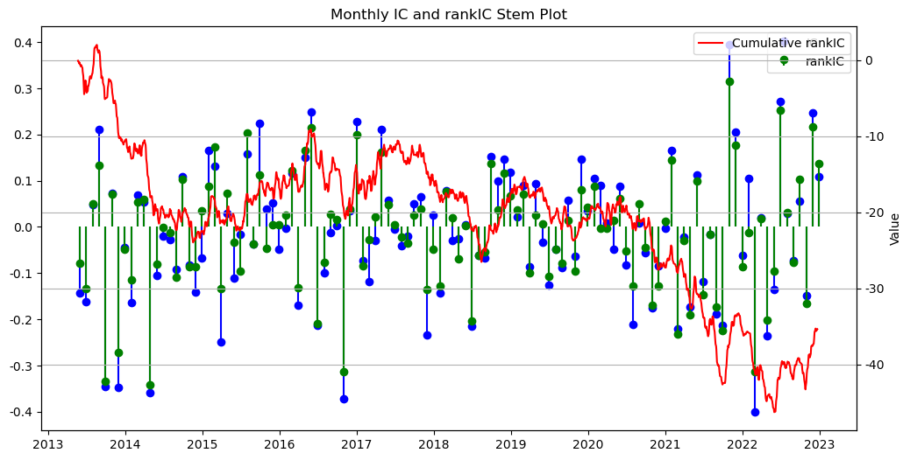
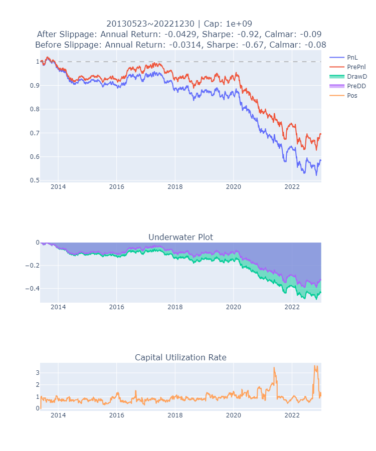

# “期货的因子化投资策略”比赛代码

## 项目概述
本仓库包含了参加“期货的因子化投资策略”比赛的代码。比赛主要聚焦于国内期货品种，进行中低频量价因子的挖掘。比赛官方提供了所有品种的日频及分钟频数据，目标是通过日频回测挖掘出具有增益的因子。

## 初始数据
- 拥有30个初始因子和量价数据。
- 初始因子包含匿名因子和带公式的示例因子。

## 因子挖掘方式
### 自动挖掘
利用 `tsfresh` 库进行滚动变换和特征提取，实现了对期货数据的滚动处理和因子衍生。
### 手工挖掘
使用 `talib` 库计算常见的技术指标作为新因子，如收盘价的斜率、相对强弱指标、威廉指标值等。

## 后续工作
在挖掘出的新因子基础上，观察因子的增益，然后依次添加到策略中进行进一步的回测和优化。

